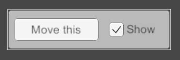
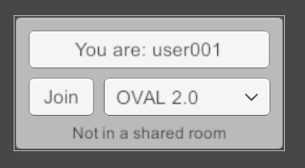
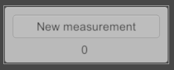

# OVAL (Oklahoma Virtual Academic Labratory)
The Oklahoma Virtual Academic Laboratory (OVAL) is a VR-Classroom application designed to encourage remote collaboration between academics. Up to on hundred users can inhabit the same VR space, import 3D content, and analyze those models with built-in tools.

Table of contents:

1. [Controls](#Controls)
2. [Menu](#Menu)
3. [Configuration file](#ConfigFile)
4. [Publications](#Publications)

## Controls
### Oculus Touch Controls

### HTC Vive Controls

## Menu

OVAL uses one slim, movable menu to provide you with many functional tools to help analyze or display your 3D content.

Menu Feature | Notes
----------------------------------------- | -------------
 | The "Move This" button on the top-left of the menu will allow you to place the menu anywhere you like for your viewing convenience.
 | OVAL is networked and allows users to meet and view 3D models in an online lab. As long as users have the same "room" defined, they will show up in the same space. One user will have complete controls. Any other user will have limited controls.
 | Specify whether the controller(s) should move you, the scene light source, or the model.
 | This allows you to switch between drag, annotate, indicate, screenshot, and measure modes.
 | This mode allows you to annotate on the model. Your laser will paint on the first surface it touches when you pull the trigger. You can select one color or two colors for a gradient for your annotation color.
 | Measure mode allows you to place to dots on or around your model. OVAL will tell you the straight-line distance between those two points to assist in measuring the model.
 | The model load screen will display any models you have added to the model directory. You can also use the button to load files located in other places on your computer. OVAL can be used to view .obj, .stl, .blend, .fbx, and .dae.
 | Apply a clipping plane to models in the scene to enable cutaways and cross-sections through data.
 | Provides screenshots when the controller trigger is pressed.
 | Provides video capture functionality.

## Configuration file

The OVAL configuration file, `OVAL.config.text`, is expected to be a simple text file in the same directory from which the OVAL application is run. This text file controls certain user-configurable options for the OVAL system.

*Note: in some situations, we may wish to combine space-separated words into a single item; in such cases, the words should be `"enclosed in quotation marks"`, e.g. "Two words", "John Smith", "C:\My Folder\Fun Data\"*

### Comment lines

Lines that start with a hash character (`#`) are treated as comments and ignored:

	# This is a comment line!

### `Color` : Custom color definitions

Custom colors for e.g. use with the annotation tool can be defined using the `Color` command. A custom color requires a name and an [RGB](https://en.wikipedia.org/wiki/RGB_color_model) color definition, with each of the three values in the RGB triplet ranging from 0 to 1. An optional [alpha value](https://en.wikipedia.org/wiki/Alpha_compositing) may be specified to control transparency; where not present, an alpha value of 1.0 (i.e., fully opaque) is assumed.

	# This color is called DarkRed; no alpha channel is specified, so we default to alpha = 1.0 (i.e., fully opaque)
	Color DarkRed 0.5 0 0

	# This color is called TransparentGreen, and has an alpha value of 0.5
	Color TransparentGreen 0 1 0 0.5

### `VROffset` : Specify a VR camera offset

Different VR systems may place the VR "camera" (i.e. the users eyes) in different starting locations. Although the OVAL system attempts to reset the VR camera position on startup, sometimes it may be necessary to adjust the initial camera location in the VR scene.  The `VROffset` setting allows the user to provide an x,y,z offset to apply to the VR camera on startup:

	# Move the initial VR camera placement by -2 units on the x axis
	VROffset -2 0 0

### `ModelPath` : Specify the default source directory for 3D models

A default source directory is used when loading 3D models in OVAL. OVAL users can only browse for models in this directory, and this directory is assumed to be the base location when models are loaded in networked multi-user [rooms](#ConfigFile:Rooms). The `ModelPath` is therefore both a security measure (i.e., users cannot browse data outside this directory in the OVAL application) and a relative file system path way to allow the same model to be loaded across different computers despite potential differences in absolute file paths.

	# Windows-style path; specify 3D model files are located in "My Models" subdirectory of Desktop
	# (or subdirectory thereof). Note: quotes to handle file paths containing a space character!
	ModelPath "D:\Desktop\My models\"

	# *nix-style path; specify 3D model files are in "models/" subdirectory of OVAL application directory
	ModelPath models/

### `ScreenshotPath` : Specify the default screenshot output directory

When using OVAL's screenshot tool, the default output path for the resultant images is the directory from which the OVAL application was run. The screenshot filename is derived from the name of the current user (see [`Username`](#ConfigFile:Username)) and the current date and time.

	# Save screenshots to the desktop (Windows-style path)
	ScreenshotPath C:\Desktop\

	# Save screenshots to the "output/screenshots/" subdirectory of the OVAL application directory (*nix-style path)
	ScreenshotPath output/screenshots/

### `Username` : Specify the local user name

A local "name" is assigned to the OVAL user to identify the user in networked sessions, and to create user-specific output files such as [screenshots](#ConfigFile:ScreenshotPath). By default, this name is inferred from the local computer's name, but it is easy to override via `Username`:

	# Explicitly name the current OVAL user as Room217, rather than using whatever
	# name OVAL infers from the local computer's name:
	Username Room217

	# If we need spaces, enclose the set of words in quotation marks ...
	Username "Tony Hawk"

### `Rooms` : Specify default network room names

OVAL allows multiple users in different locations to participate in the same VR spaces, referred to as "rooms". By default, the user can enter a room name using OVAL's virtual keyboard. However, it is often better to provide one or more default room names for convenient user selection. This is accomplished via `Rooms`:

	# Specify three default rooms: Room1, MeetingSpace, and Common VR Area (note: quotes enclosing the latter)
	Rooms Room1 MeetingSpace "Common VR Area"

### `NetworkRegion` : Specify default network region for shared rooms

OVAL's multi-user network code is based on infrastructure provided by [Photon](https://www.photonengine.com/en-US/Photon), which directs users to network servers with the best performance. However, this process can send users to rooms of the same name but hosted on *different servers*; in such cases, users are effectively in *different rooms* and will not "see" one another. To avoid this, OVAL allows the user to explicitly set the [regional server](https://doc.photonengine.com/en-us/realtime/current/connection-and-authentication/regions) used via the `NetworkRegion` option (default value: `us`)

	# The default Photon server region for OVAL is "us" (east coast USA)
	# https://doc.photonengine.com/en-us/realtime/current/connection-and-authentication/regions
	NetworkRegion us

### `DefaultPanels` : Specify the default visible user interface panels

The OVAL user interface consists of one or more panels that provide specific functionality. In some cases, it may be desirable to show or hide one or more of these panels when OVAL starts. To control the UI panels shown by OVAL on startup, the `DefaultPanels` command may be used. The standard panel names are: `MoveUIPanel`, `NetworkPanel`, `MovePanel`, `ModePanel`, `ModelPanel`

	# Show OVAL's default set of user interface panels
	DefaultPanels MoveUIPanel NetworkPanel MovePanel ModePanel ModelPanel

	# This setting may be suitable for presentation of a specific VR scene,
	# where we don't need the capability to load models, join networked
	# rooms, or move the lights etc. We therefore omit NetworkPanel,
	# MovePanel, and ModelPanel!
	DefaultPanels MoveUIPanel ModePanel

## OVAL-related Publications
- [Multi-Campus VR Session Tours Remote Cave Art](https://campustechnology.com/articles/2017/10/09/multi-campus-vr-session-tours-remote-cave-art.aspx)
- [Library Journal - University of Oklahoma Expands Networked Virtual Reality Lab](http://lj.libraryjournal.com/2016/08/academic-libraries/university-of-oklahoma-expands-networked-virtual-reality-lab/)
- [Library Journal - Virtual Reality and How to Build an Interdisciplinary Hub](http://lj.libraryjournal.com/2017/09/academic-libraries/carl-grant-virtual-reality-build-interdisciplinary-hub/#_)
- [The Design & Development of an Immersive Learning System for Spatial Analysis and Visual Cognition](http://static1.squarespace.com/static/532b70b6e4b0dca092974dbe/t/5755e2df20c647f04c95598a/1465246433366/pobercook_text+(1).pdf)
- [Virtual Serendipity: Preserving Embodied Browsing Activity in the 21st Century Research Library](http://www.sciencedirect.com/science/article/pii/S0099133317301520)
- [A Hub for Innovation and Learning](https://campustechnology.com/Articles/2018/01/31/A-Hub-for-Innovation-and-Learning.aspx?Page=1)
	****************************************************
